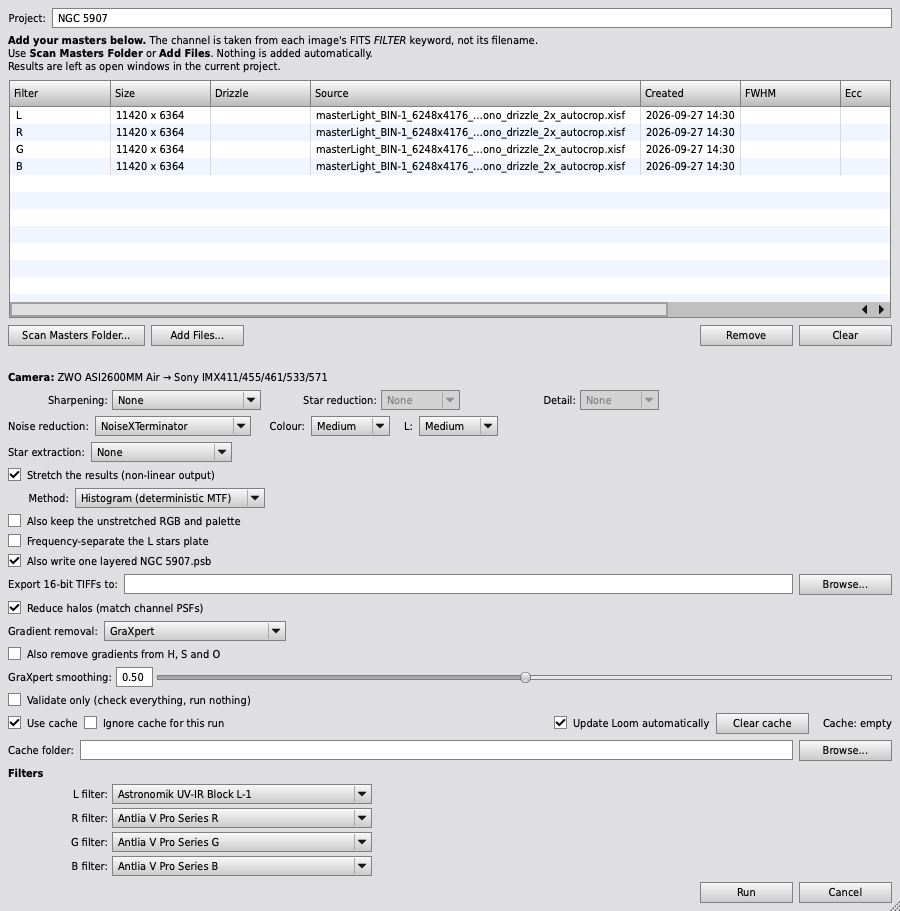
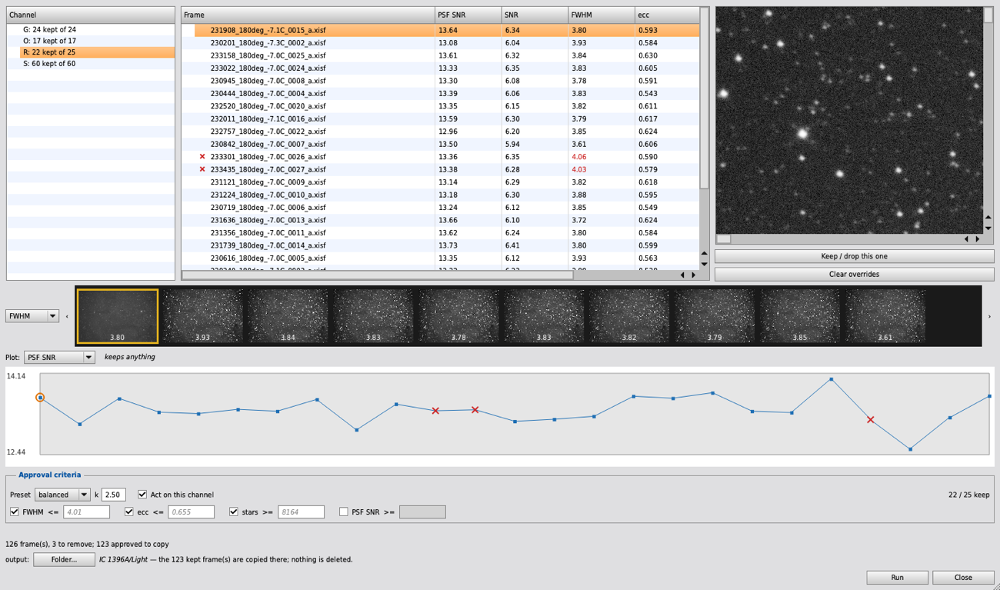
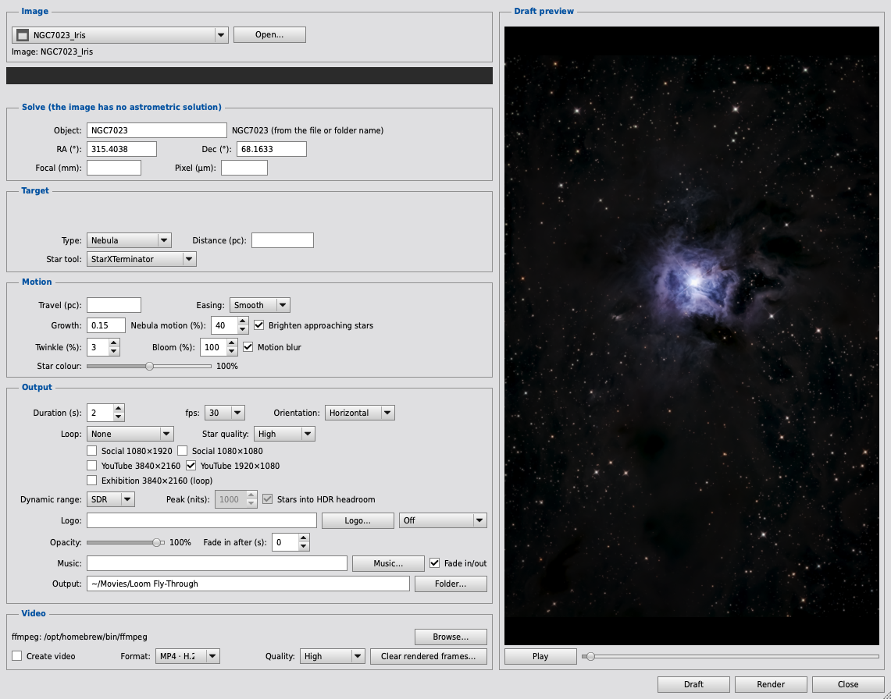

# Loom

Three PixInsight scripts for the work between capture and making pictures:

- **[Loom](#loom-1)** takes integrated masters to finished plates: solving,
  flux calibration, gradient removal, registration, cropping, combination and
  colour calibration, optionally followed by sharpening, star extraction,
  stretch, noise reduction and a layered Photoshop file.
- **[Frame Selector](#frame-selector)** measures a folder of subframes and
  removes the bad ones before you integrate. It can also import a night
  straight from an ASIAIR.
- **[Fly-Through](#fly-through)** turns a finished image into a push-in video
  whose stars pass by at their real Gaia distances.

**Loom is for people who already know PixInsight.** It is not a wizard and does
not explain what SPFC is. The options are few, each a decision only you can
make; everything else is measured from your data or fixed by a published
convention. The steps and their order are fixed: you choose which tools run and
how hard, not when. Where it cannot decide on evidence, it asks, or does
nothing. Nothing is clipped that is not a single-pixel defect. Results stay as
open windows; Loom writes to disk only when you ask it to export.

## Installation

Install from the PixInsight update repository or from git, not both: two
copies register the scripts twice.

### From the PixInsight update repository (recommended)

1. **Resources → Updates → Manage Repositories.**
2. Click **Add**, enter this address (with the trailing `/`), and confirm:

   ```
   https://fcarucci.github.io/Loom/
   ```

3. **Resources → Updates → Check for Updates.** Make sure Loom is selected and
   click **Apply**.
4. The repository is not yet signed, so PixInsight asks you to confirm the
   download from an unsigned source. Confirm it.
5. **Restart PixInsight** when asked; updates are installed while it restarts.

The scripts appear under **Script → Loom**: **Loom**, **Frame Selector** and
**Loom Fly-Through**. If they do not, run **Script → Feature Scripts →
Regenerate**, then **Done**. To update later, use **Check for Updates** again:
an install from the repository (or from a release zip) does not update itself.

### From git

```
git clone https://git.local.carucci.studio/francesco/Loom.git ~/PixInsight/scripts/Loom
# or, from the GitHub mirror:
git clone git@github.com:fcarucci/Loom.git ~/PixInsight/scripts/Loom
```

Any location works. Then **Script → Feature Scripts → Add**, choose the
**Loom folder** (not its `script` subfolder), and click **Done**. PixInsight
registers scripts by absolute path, so after moving or renaming the folder, add
it again. To remove a stale entry, untick it and click **Done** (there is no
Remove button); **Regenerate** drops entries whose file no longer exists.

A git checkout updates itself. With **Update Loom automatically** ticked in the
Loom dialog (the option appears only in a checkout), each launch checks for a
newer Loom before the dialog opens and says what it found. If there is one, it
is fast-forwarded and **Loom restarts itself** on the new version. The check
gives up after fifteen seconds. A checkout with local changes is never touched,
a diverged branch is refused rather than merged, and any failure is named in
the Process Console and recorded in `<cache>/update/update.log`. The title bar
shows version and commit, for example `Loom 0.1 (a4c1f2e)`.

### Optional tools

Loom detects these and offers only what your installation can run.

| kind | tools | how they are found |
|---|---|---|
| **Modules** | BlurXTerminator, StarXTerminator, NoiseXTerminator, GraXpert, StarNet2 | by name |
| **External programs** | SyQon Studio (`syqon-cli`), SyQon Parallax (`parallax_cli`), SyQon Prism (`prism_cli`), SyQon Starless (`SyQonStarless`) | a path remembered in Loom's settings, else the config file SyQon's own scripts write, else a scan of `/Applications` and `~/Applications` (Program Files and `%LOCALAPPDATA%\Programs` on Windows). For SyQon Studio, `SYQON_CLI_PATH` comes first |
| **MLDenoise** | PixInsight's MachineLearning module plus a `.xmlm` model | see [Requirements](#requirements) |

What the search finds is remembered, so it normally runs once.

### Check the install

Open **Script → Loom → Loom**, add masters, and tick **Validate only (check
everything, run nothing)**. It runs every preflight check (files and views
present, required FITS keywords, installed processes, the MARS database) and
executes nothing. Do this first on a new setup or a new dataset.

## Loom



### How to use

1. **Add masters.** **Scan Masters Folder...** picks the newest master per
   filter from a WBPP masters folder, preferring drizzled and autocropped
   variants; **Add Files...** picks them directly. A view dragged onto the list
   also works, and beats a file for the same channel. The channel comes from
   each file's `FILTER` keyword.
2. **Check the list.** **Created**, **FWHM**, **Ecc**, **Noise** and **Stars**
   (from SubframeSelector) show each master against the previous integration of
   its channel, coloured when it got worse: Loom always uses the newest master.
   Measuring takes about 16 s per master the first time, then is cached.
3. **Check the camera** under the list, with the QE curve it maps to. A master
   whose `INSTRUME` was lost (WBPP's autocrop removes it) takes the camera its
   siblings name.
4. **Name the project** at the top. It follows the masters' folder until you
   type your own, and names the exported PSB.
5. **Set the options** below, then **Run**. A Cancel window stops the run at
   the next checkpoint, after asking; cached stages survive, the step in
   progress does not.

**Caching.** Every stage is cached on its inputs and parameters: a repeat run
does no pixel work, and a changed setting recomputes only its stage and those
after it. **Ignore cache for this run** recomputes without discarding; **Clear
cache** discards. Point **Cache folder** somewhere with room rather than the
system temp directory, which the OS may purge. Every run, failed ones included,
logs to `<cache>/logs/loom-run-<timestamp>.log`, which **Clear cache** keeps.
A saved instance icon reuses a configuration (file selections only, not views).

### What it does, and the options

#### Per channel, on native pixels

| step | what | options |
|---|---|---|
| **Solve** | plate solution, skipped if one is present; recursive surface splines, and every solve is verified against the catalogue | — |
| **SPFC** | spectrophotometric flux calibration. Broadband only | filter curve per L/R/G/B; camera from `INSTRUME` |
| **MGC** | MultiscaleGradientCorrection against MARS. Broadband only | MARS folder, asked for only if PixInsight does not already know one |
| **Gradient removal** | a second background pass on the linear channels | **Multi Gradient only** (no second pass), **GraXpert** (with its smoothing) or **SyQon Studio Deep Gradient**. **Also remove gradients from H, S and O** is off by default, because faint emission can be taken for background |
| **Aberration** | star-shape correction, before registration | None, BlurXTerminator, SyQon Parallax or SyQon Studio Parallax. With SyQon Studio installed, Studio Parallax does the aberration pass even when BlurXTerminator is chosen; BlurXTerminator then does star reduction and detail |

The log grades each solve by its median deviation: 3.0 px or more is wrong,
above 0.315 px is poor.

#### Across channels

| step | what | options |
|---|---|---|
| **Register** | to L, which is never resampled. Without L, to the channel with the best-defined stars (lowest FWHM / √stars), falling back to G, R, B, Ha, SII, OIII. The log names the choice | — |
| **Crop** | to the area every channel covers | — |
| **Halo match** | blurs each channel's PSF up to the widest, L excluded. Removes colour halos, at the cost of the sharpest channel's resolution | **Reduce halos (match channel PSFs)** |
| **White balance reference** | measured on channels the aberration correction never touched | automatic |

#### RGB composite

| step | what | options |
|---|---|---|
| **Combine** | R, G, B | — |
| **Solve, SPFC, SPCC** | calibration of the composite | filter curves |
| **Sharpen** | star reduction and detail on the composite | **Star reduction** and **Detail**: None/Low/Medium/High |
| **Extract stars** | splits into starless and stars | None, StarNet2, StarXTerminator, SyQon Starless or SyQon Studio Axiom |
| **Stretch** | see [Stretch](#stretch) | on/off, method |
| **Denoise** | on the finished L, RGB and palette (their starless plates when stars are extracted), never on the stars plate or single channels. Where it runs is set by the tool: NoiseXTerminator, MLDenoise and SyQon Studio Prism Essential on linear data, after star extraction and before the stretch; standalone SyQon Prism and SyQon Studio Prism 2.0 after the stretch | tool, and a strength (Low/Medium/High; Medium/High for Prism 2.0) for **Colour** and for **L** separately. Medium is each tool's own default |

**SyQon Studio Prism 2.0** is Studio's paid Deep Prism and runs after the
stretch (Medium: Ultra, High: Max). With the stretch off it offers Medium only,
Ultra on the linear image. Its Advanced pass on linear data, and with it Low,
is off for now: Advanced left faint tile seams that the stretch turned into
flat bands, and it stays off until SyQon fixes it. If your SyQon account cannot
run the models your strengths use, **SyQon Studio Prism Essential** is offered
in its place until a later check succeeds.

Each SyQon Studio model a run will use is tried once per PixInsight session
(about 13 s each); one your account cannot run stops the run before it starts,
by name. Studio may ask for your Mac password to reach its Keychain sign-in:
choose **Always Allow**, or it asks every run.

#### Narrowband palette

Built independently of RGB; either can be produced without the other. No SPFC
and no broadband SPCC: a palette is an aesthetic mapping, not a photometric
one.

| step | what | options |
|---|---|---|
| **Combine** | channels mapped to R, G, B | SHO, HOO, HSO |
| **SPCC narrowband** | emission-line calibration | filter bandwidth in nm (line wavelengths are fixed) |
| **Normalise** | a NarrowbandNormalization pass after SPCC | **Normalise the palette**; off keeps SPCC's line ratios exactly |
| **Sharpen, extract, stretch, denoise** | as for RGB | as above |

#### Stretch

Off by default. **Histogram (deterministic MTF)** gives each plate one
HistogramTransformation from that plate alone: black point at its darkest level
that is not a single-pixel defect, midtone placing its sky median at a fixed
target. Nothing to set, and the same input always gives the same output.
**MultiscaleAdaptiveStretch** uses target background 0.15, aggressiveness 0.70,
dynamic range compression 0.40 and contrast recovery at full intensity, with
scale separation at the process default; save a MultiscaleAdaptiveStretch
process icon to change them, and Loom uses it instead.

The stars plate always uses the histogram stretch, before extraction and at its
own target; the starless plates are stretched after. Each looks right alone,
and they will **not** screen back together into the original.

**Also keep the unstretched RGB and palette** keeps `RGB_linear` and
`<palette>_linear` too (not L). Off by default: each costs a second full-size
image in the cache.

#### Export

Set a folder in **Export 16-bit TIFFs to:** and every result is written there
as a 16-bit TIFF named after its window (`RGB_starless.tif`, `RGB_stars.tif`,
...); leave it empty and nothing is written. The plates on screen stay 32-bit.
Export needs the stretch: a linear plate would posterise at 16 bits, so Loom
writes nothing and says why.

**Colour profiles.** Files and open plates carry **ROMM RGB** (ProPhoto RGB)
or Generic Gray; the PSB embeds Adobe's `ProPhoto.icm` where installed. Where
those are missing, as on Windows, Loom uses the widest installed working space
(Rec. 2020, Wide Gamut RGB, Adobe RGB (1998), Display P3, sRGB) and logs which.

**Frequency-separate the L stars plate** splits `L_stars` into `L_stars_low`
and `L_stars_high`, blurred by the plate's own star size, so cores and halos
can be retouched separately. The high layer over the low one in **Linear
Light** gives the original back.

**Also write one layered `<project>.psb`** writes one Photoshop Large Document
into the export folder, bottom to top:

| layer | |
|---|---|
| **HSO** group | the palette starless plate, with **Ha**, **SII** and **OIII** Curves layers set to the channel each line was mapped to |
| **RGB** group | the broadband starless plate, hidden |
| **Stars** group, *Screen* | RGB stars, and the L stars plate in *Luminosity*; with frequency separation on, an **L Stars** group holding the low layer and the high layer |
| **Stars Curve**, **Stars Saturation** | clipped to the stars |

Expect about 3 GB for a modern sensor (hence PSB, not PSD) and a minute to
write. Photoshop always opens a Curves layer on RGB, so each layer's name
carries its channel: `Ha[R]`, `SII[G]`, `OIII[B]`, or `OIII[G,B]` for HOO.

### Outputs

With star extraction on: `L_starless` + `L_stars`, `RGB_starless` +
`RGB_stars`, and `<palette>_starless`; the unsplit plates are not kept, since
starless and stars rebuild them, and narrowband stars only when there is no RGB
composite. With it off: `L`, `RGB`, `<palette>`, and the narrowband channels
themselves when no palette was built. The plates are left open and cascaded in
the middle of the workspace, always in the same order, the palette on top.

## Frame Selector



**Script → Loom → Frame Selector** measures every subframe in a folder with
SubframeSelector (the same numbers WBPP shows), groups them by `FILTER`, works
out where the line falls for each channel on that night, and deletes the frames
below it, or copies the rest to another folder.

A channel whose frames differ in exposure, binning, geometry or calibration
state is flagged as not comparable; that is a warning, and Run still acts on
it. Frames with no readable filter are shown but never rejected automatically.

### Presets and criteria

Each channel has its own preset, which sets `k`, the width of the cut in
normalised MADs:

| preset | `k` | expected rejection, many frames | at 20 frames | at 10 frames |
|---|---|---|---|---|
| Lenient | 3.0 | ~0.5% | ~2.8% | ~6% |
| Balanced | 2.5 | ~2.5% | ~6.1% | ~10% |
| Strict | 2.0 | ~9% | ~13.1% | ~17% |

The dialog shows the actual count. Below 10 valid measurements in a channel
the cut does not run.

All four measurements rank frames (PSF SNR most heavily), but by default only
**FWHM**, **eccentricity** and **star count** reject. **PSF SNR** does not,
because integration already weights frames by signal, so dropping a faint frame
loses signal for nothing; you can turn it on per channel. No weighting repairs
a soft or elongated frame, and a drop in star count is the sign of cloud.

The criteria panel has the preset, `k` and the channel switch, then one
criterion per metric (`FWHM <=`, `ecc <=`, `stars >=`, `PSF SNR >=`), each a
checkbox and a limit, and the number of frames Run keeps. An untouched limit is
**automatic**: greyed and in italics, it shows the cut `k` gives on this night.
**Type a number** to replace the automatic cut for that metric only (clear it
to go back); it stays when the preset or `k` changes, and typing one on every
metric keeps a whole good night. A typed limit applies once confirmed (Return,
or moving to another box; Run confirms one still being edited). **Untick** a
criterion to switch it off.

The keep count means what Run does: the frames left in place, or when copying,
the frames copied. A channel switched off is not copied at all.

### Reviewing

Reading a folder is the slow part, and can be stopped. A scan writes nothing.

- **Table**: one row per frame, named by what differs (full path on the
  tooltip). A red cross marks a frame Run leaves out, and the measurement that
  rejected it is red. SubframeSelector's **SNR** is shown for reading only.
- **Plot**: the channel's measurement in frame order, with the range that keeps
  a frame drawn as a band. Click a point to select its row.
- **Filmstrip**: the channel's thumbnails, the selected one in yellow, rejected
  ones crossed; the chooser at its left picks the number shown. Grey tiles are
  not read yet; `!` could not be read.
- **Preview**: 1:1. Double click toggles whole frame; drag, use the scroll bars
  or the arrow keys (Shift for a page). Trackpad swipes do not scroll it.
  Changing frame keeps the view in place, so the same stars stay in view.

**Override** a verdict with Space or the button under the preview. It survives
a change of `k`, is counted separately and logged, and lasts for the session.

### Anomaly tags

Frames that look wrong against the rest of their channel are tagged with the
likely cause. Tags are advisory: they never change a verdict.

| tag | letter | fires when |
|---|---|---|
| ALTITUDE | A | FWHM 20% above the sharpest quarter of the channel, but not once corrected for airmass |
| FOCUS | F | FWHM 20% above even after the airmass correction, across consecutive frames |
| SEEING | S | FWHM 20% above after the correction, on one frame between sharp neighbours |
| TRACKING | T | eccentricity more than 3σ above the channel's median |
| CLOUD | C | star flux 25% below the median beyond what extinction explains, or background 5% above it |
| DROPPED | D | fewer than 10% of the channel's median star count |

A low star count alone names nothing. Without an altitude the airmass
correction is skipped; without frame times a blurred frame is FOCUS. A metric
needs 5 usable values; channels not comparable or without a filter are not
tagged. Tags show on the preview, as letters on the filmstrip, and in the
summary line.

### Deleting or copying

**Deleting in place** is the default, and the only irreversible thing the tool
does. A confirmation gives the exact count per channel, and the list is written
to a log under `~/PixInsight/Loom-frame-selector/` before any file is removed;
if the log cannot be written, nothing is deleted. A frame that changed since it
was measured (checked by digest), vanished or became unreadable is skipped and
reported.

**Copying to another folder** writes the approved frames there as XISF and
leaves the originals alone. **The output folder is emptied first**, without
asking, hidden files and subfolders included (a symbolic link is removed, never
followed). If anything in it cannot be removed, nothing is copied. Run refuses
to empty a folder that is or contains a source folder, the filesystem root, or
your home folder. Deleting the originals after a copy is not offered.

### Importing from an ASIAIR

Plug the ASIAIR in over USB-C, or mount its card, and open the Frame Selector.
It recognises the ASIAIR by its `Plan/Light` or `Autorun/Light` folders,
whatever the volume is called, and offers it before the folder chooser; decline
and nothing changes. Cancel stops the card read. A stalled network mount can
hold up detection.

Every target is listed with its last three nights: frames, filters, and flats
filter by filter, a filter with no flats in red. A night is one target in one
session, and a session ends at a gap of more than four hours, so two sessions
on one date stay separate. Flats are matched to a night as a whole batch, by
filter and binning, and by camera and rotation where both state them; gain is
not compared, as WBPP groups flats by gain itself.

Review the night as usual, then Run:

- **Choose a destination**; nothing is ever written to the ASIAIR. A folder
  named `Light` or `Flat` means its parent.
- Approved lights go to `<destination>/Light` and the night's flats to
  `<destination>/Flat`, as XISF. Two frames that would get the same name are
  refused rather than overwritten.
- Each written file is reopened and checked (geometry, `FILTER`, `EXPTIME`,
  `DATE-OBS`); one that fails is deleted and reported.
- The review is then locked, so the night cannot be imported twice.

Darks and bias frames are not imported.

## Fly-Through



**Script → Loom → Loom Fly-Through** turns a finished image into a push-in
video: the camera moves towards the target and the image's own stars pass by at
their real distances. [See an example: the Elephant's Trunk
(IC 1396A)](https://www.youtube.com/shorts/1aVtptmTbuY).

Star distances come from **Gaia DR3 parallaxes**, and nearer stars move
faster, grow and brighten by real 3-D geometry; the rest stay in the starless
backdrop. A nebula sits at the distance of its ionising cluster (Trumpler 37 at
922 pc for IC 1396); a galaxy stays fixed. Each star is modelled from your own
stars layer, spikes included.

### How to use

1. **Choose an image**: an open one, or **Open…** a FITS, XISF or TIFF file.
   It is resampled to a 4K working size, solved, analysed and its stars
   extracted, with progress and Cancel. The dialog shows how many stars were
   detected, how many move, and how many stay in the background.
2. **Solving.** A solved image is used as is. For an unsolved one (usually a
   TIFF), type the **Object** (NGC/IC, Messier, or a name such as *Elephant's
   Trunk*; typos are forgiven) or RA/Dec, and the **Focal** length and
   **Pixel** size, remembered for your rig. Drizzled images are found at half or
   a third of the pixel size. With nothing typed, Loom solves blind. What you
   enter is remembered per image.
3. **Draft**: a quick 480 px, quarter-frame-rate SDR preview. Adjust and draw
   it again.
4. **Render** writes the full frames and the video. Cancel finishes the current
   frame and keeps what is written. Every option is remembered.

**Blind solving** uses Gaia (your local database, else Gaia DR3 online),
searching near your earlier solves first, then named objects, Messier, NGC/IC
and the whole sky; PixInsight's ImageSolver must confirm the match. Regions are
cached in `PixInsight/Loom/solver` in your home folder. The solve gives up after
five minutes without a catalogue answer, or at once offline with nothing local
or cached. An empty Object box gets the name of the target found.

### Options

| option | what it does |
|---|---|
| **Type**, **Distance (pc)** | Nebula (moves at the given distance, filled from its cluster) or Galaxy (fixed) |
| **Star tool** | StarXTerminator, StarNet2, SyQon Studio or SyQon Starless, whichever you have |
| **Travel (pc)**, **Easing** | how far the camera moves in (at most 0.9 of a nebula's distance); Smooth or Linear |
| **Growth**, **Brighten approaching stars** | how much approaching stars grow (0.15 by default); inverse-square brightening, on by default |
| **Nebula motion (%)** | how much the nebula grows, as a share of what its distance gives; 40% by default, 100% is physical and far too much to watch |
| **Twinkle (%)**, **Bloom (%)**, **Motion blur**, **Star colour** | a slow per-star shimmer (3%, not physical, 0 is off); the glow of stars past white; streaks from a 180° shutter; star saturation |
| **Duration (s)**, **fps**, **Orientation**, **Loop** | length; 24, 25, 30 or 60 fps; Horizontal or Vertical (a vertical image is turned, never cut); None, Back and forth, or Crossfade from end to start |
| **Star quality** | Highest (from the 4K working image), High (default, looks the same, about 30% faster), Medium (softer stars, about three times faster than Highest) |
| **Presets** | Social 1080×1920 and 1080×1080, YouTube 3840×2160 and 1920×1080, Exhibition 3840×2160 (loop) |
| **Dynamic range**, **Peak (nits)**, **Stars into HDR headroom** | SDR or HDR, see below |
| **Logo**, **Opacity**, **Fade in after (s)** | a logo (PNG transparency kept) in one of seven places, sized for each preset |
| **Music**, **Fade in/out** | looped if shorter, cut to the video; a looping video's music crossfades end into start |
| **Output**, **Create video**, **Format**, **Quality** | the folder for frames and video (the image's own folder by default); the video, when ffmpeg is found |
| **Clear rendered frames…** | deletes the frames kept for reuse, so the next render draws every frame afresh |

### Output

16-bit TIFF frames per preset, plus a video when ffmpeg is installed
(`brew install ffmpeg` on macOS, `winget install Gyan.FFmpeg` on Windows).
ffmpeg is found automatically; **Browse…** overrides it. Only formats it can
encode are offered: MP4 H.264, MP4 H.265/HEVC (tagged for Apple players), MOV
ProRes 422 HQ and WebM VP9. Without ffmpeg the frames are still written and the
exact command is printed. Rendering again with only a new format, quality or
music reuses the frames. Videos are named after object, preset and encoding,
for example `NGC7023_Iris_Nebula_youtube_1080_vertical_HDR-PQ.mp4`. Every frame
is converted from the image's own ICC profile to Rec.709.

**HDR** keeps star light that SDR would clip, rolled off towards the peak (1000
nits by default). Social and YouTube default to **HLG**, which also looks right
on SDR screens; Exhibition to **PQ (HDR10)**, with mastering metadata measured
from the frames. HDR uses HEVC 10-bit (default), VP9 10-bit or ProRes; H.264 is
SDR only. The draft is always SDR, so judge HDR in the video.

**Render time**: about 1.8 s per 1920×1080 frame on an Apple M4 Max (1,288
moving stars), so 18 minutes for 20 s at 30 fps. The dialog shows an estimate.

**Known limits.** Star distances use Gaia's typical parallax error for each
magnitude, not each star's own, so a few stars sit at the wrong depth. The
cluster finder has been checked on IC 1396 and the North America Nebula; its
distance is always shown, with member count and range, and you can edit it.
Fly-Through has not yet been run by hand on Windows.

## Requirements

- **PixInsight 1.9.4 or later** on macOS or Windows, checked at startup. On
  1.9.4 solves are not verified or spline-fitted, and Loom has not been run by
  hand there. Developed on macOS; a full Windows run has been done on 1.9.5.
- **A camera Loom recognises**, read from `INSTRUME`: the IMX571 family
  (ASI2600/6200/533/094, QHY268/600), IMX178, IMX183, IMX492, IMX585, MN34230
  and the KAF sensors. Anything else is calibrated against the Ideal QE curve.
- **A MARS database** (`*.xmars`) for MGC: the folder set in Loom's dialog,
  else a saved MultiscaleGradientCorrection process icon, else what the MGC
  interface remembers; Loom asks only when none gives one. A run with broadband
  channels and no MARS database is refused before it starts.
- **Gaia**: the database set up in PixInsight for SPFC and SPCC. Fly-Through
  uses it too, and its blind solver can fall back to Gaia DR3 online.
- **Optional:** the tools in [Optional tools](#optional-tools), and ffmpeg for
  Fly-Through video.
- **MLDenoise needs a model**, which PixInsight does not ship: install a `.xmlm`
  model from the Databases repository under **Resources → Updates**. Loom looks
  in the install's `library`, then `~/PixInsight/library`, then
  `~/PixInsight/models`, and offers MLDenoise only when module and model are
  both present.

## Development

`script/selftest.js` is the PixInsight test suite (not part of installation; it
writes its results to a file and is run from the command line). The Node suite
is `node ci/run-tests.js`. Design notes, including the stretch derivation, are
in `docs/superpowers/specs/`; release notes in [CHANGELOG.md](CHANGELOG.md).
